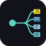

<p align="center"></p>

<h1 align="center">foundry-transpile</h1>

<p align="center">A from-scratch <b>source-to-source transpiler</b> built on a shared typed IR — many source languages in, many target languages out. Zero dependencies, pure Node.</p>

<p align="center">
  
  
  
  
  
  
</p>

---

Part of the **Foundry Tools** engines. The architecture is the point:

```
 source code ──[frontend]──▶  typed IR (AST)  ──[backend]──▶  target code
   MiniLang ───┐            lexer→parser→type-checker      ┌─ JavaScript · Python
   JavaScript ─┤                                           ├─ C · Go
   Python ─────┤─▶ (infer)  (annotates every node)         ├─ Java · C#
   TypeScript ─┤                                           ├─ Rust · Lua
   C ──────────┘                                           └─ Kotlin
```

**5 source languages × 9 target languages.** MiniLang/TypeScript/C carry explicit types; the JS and
Python frontends infer them. The C frontend even maps `printf` format strings into concatenations and
turns `int main()` into the IR's void entry.

Each **source** language has a *frontend* (text → IR); each **target** language has a *backend*
(IR → text). Any frontend composes with any backend, so **N frontends + M backends give N×M
transpilations** — the only way "translate as many languages to as many as possible" scales without
writing a pair for every combination. Three frontends (MiniLang, **a real JavaScript subset**, **a
real Python subset**) × four backends already covers paths like **JS → Python**, **Python → C**,
**Python → Go**, and **JS → Go**.

The JavaScript and Python subsets have no type annotations, so their frontends run **type inference**
(`src/infer.js`) to reconstruct the parameter, return, and local types the statically-typed backends
need — inferred from how each value is used. After inference the normal checker validates the result,
so a wrong guess surfaces as a type error, never as bad output. (The Python frontend's tokenizer emits
INDENT/DEDENT tokens so significant whitespace is handled like CPython's own.)

The IR is a **typed** AST: a real type-checker annotates every expression, which is what lets the
backends emit correct code for languages that disagree about fundamentals:

- **integer division** — `17 / 5` must be `3` everywhere (JS `Math.trunc`, Python `int(...)`, the rest
  truncate natively)
- **float printing** — every target prints `2.5` and `40.0` identically via a canonical formatter
  (6 decimals, trailing zeros stripped) instead of each language's wildly different default
- **string concatenation** — including `string + int`; native where possible, `str()`/`fmt.Sprint`
  where needed, a **rotating-buffer runtime in C** (no string type) and `String` + `format!` in Rust
- **arrays** (`int[]`, `float[]`, and `string[]`) — literals, `array(n)`, indexing, `len`/`.length`,
  array params, and **in-place mutation through a function**; a native list/slice/`Vec`/array
  everywhere, but a malloc'd **`IntSlice`/`FloatSlice`/`StrSlice`** in C, **1-indexed** tables in
  Lua, and `&mut Vec<…>` borrows + `usize` casts + `.clone()`'d `String` elements in Rust. Usable
  from **all five** source languages — including real C (`int a[] = {…}`, `int*`/`int a[]` params,
  and the `sizeof(a) / sizeof(a[0])` length idiom map straight onto the IR's arrays)
- **structs** — declarations, positional construction (`Point(3, 4)`), field access/assignment, and
  mutation through a function, with **reference semantics on every target**: object literals in JS,
  classes in Python/Java/C#, tables in Lua, `*Point`/`&Point{…}` in Go, malloc'd pointers in C, and
  owned values passed `&mut` in Rust (the checker rejects aliasing, so the models agree). Usable
  from **all five** source languages: JS/Python **classes** (field types inferred from constructor
  call sites), TS **parameter-property classes** (`constructor(public x: int)`), and real **C
  structs** (`struct Point *p` params, `&p` arguments, `->`/`.` access, brace initializers).
  **Arrays of structs** (`Point[]` — a per-struct `PointSlice` in C, `Vec<Point>` in Rust) and
  **nested structs** (`p.inner.v`, replacing `p.inner` wholesale) work too; the aliasing ban
  extends to `let q = xs[0]` and `let q = p.inner`, which is what keeps Rust's ownership model in
  agreement with the reference-semantics targets
- **booleans** — `print(flag)` and bool-in-concatenation say `true`/`false` on every target (Python
  would say `True`, C `1`, C# `True`, and Lua's `..` refuses booleans outright — all normalized)
- **loops** — native 3-clause `for` where the target has one (JS/C/Go/Java/C#), a scoped
  while-fallback where it doesn't, and **`break`/`continue` everywhere** — `continue` still runs
  the for-update on the fallback targets, and Lua (which has no `continue`) gets a `goto` to an
  end-of-body label
- **ternary** — `c ? a : b` (or Python's `a if c else b`) maps to each target's conditional
  expression; Go has none, so it becomes an immediately-invoked closure, and Lua gets a real
  branch (the `and/or` trick breaks on `false`)
- **string ops** — `len(s)`, end-exclusive `substr(s, a, b)` (a malloc'd helper in C, `string.sub`
  in 1-based Lua), and full **string ordering** (`strcmp` in C, `compareTo` in Java,
  `CompareOrdinal` in C# — which has no `<` on strings at all)
- **numeric casts** — `int(x)` / `float(x)` (`(int)x` in C source, `Math.trunc` in JS source,
  real `int()` in Python source), truncating toward zero on every target — even Lua, via
  `math.modf`
- `&&`/`||` vs `and`/`or`, braces vs indentation, `==` vs `.equals` for Java strings (and `strcmp`
  in C), static type declarations for C/Go/Java/C#/Rust, and `let mut` for reassigned Rust bindings

### How it's verified

The test harness transpiles each example to **every target, runs every one, and asserts the
outputs are byte-for-byte identical**. The languages can't agree by accident — if any backend is
wrong, FizzBuzz or the factorial table diverges.

On top of the example suite there's a **property-based fuzzer** (`node test/fuzz.js [seed]
[count] [targets…]`): it generates random — but always valid and terminating — programs
exercising arithmetic, strings, ternaries, casts, loops with `break`/`continue`, and function
calls, runs them through every backend, and asserts cross-target agreement. Failures are saved
to `test/fuzz-failures/` with the seed, so every finding reproduces.

Identifiers that collide with a target's keywords are renamed per backend (`out` is fine in
MiniLang but not in C#; `end` is fine everywhere but Lua), and the sharp edges of each runtime
are normalized — including **`%` on negative operands** (Python and Lua floor-mod; everyone else
truncates — both now agree with the rest).

## Use it (CLI)

```bash
# MiniLang source -> any target
node bin/transpile.js --to python examples/fizzbuzz.ml
node bin/transpile.js --to go     examples/arithmetic.ml
node bin/transpile.js --to c      examples/factorial.ml > factorial.c

# real JavaScript source -> Python / C / Go
node bin/transpile.js --from js --to python examples/js/gcd.js
node bin/transpile.js --from js --to go     examples/js/factorial.js

# real Python source -> JS / C / Go
node bin/transpile.js --from python --to c  examples/py/primes.py
node bin/transpile.js --from python --to js examples/py/fizzbuzz.py

# TypeScript source -> Lua / Rust / Kotlin (floats and all)
node bin/transpile.js --from ts --to lua    examples/ts/stats.ts
node bin/transpile.js --from ts --to rust   examples/ts/stats.ts
node bin/transpile.js --from ts --to kotlin examples/ts/shapes.ts

# real C source -> Rust / Python (printf becomes concatenation)
node bin/transpile.js --from c --to rust   examples/c/collatz.c
node bin/transpile.js --from c --to python examples/c/primes.c
```

## Use it (library)

```js
const { transpile } = require("./src");
const go = transpile("func main(): void { print(6 * 7); }", { to: "go" });
```

## The MiniLang source language

A small but real statically-typed imperative language: `int` `float` `bool` `string`, arrays of all
four (`int[]`, …) plus arrays of structs, `struct` declarations (nestable), functions with typed
params and recursion, `let`/assignment, `if`/`else if`/`else`, `while`, `for`, `break`/`continue`,
the `?:` conditional, arithmetic and comparison operators (strings order too), `&&`/`||`/`!`,
arrays (`[1, 2, 3]`, `array(n)`, `a[i]`, `len(a)`), strings (`len(s)`, `substr(s, a, b)`,
concatenation with anything), casts (`int(x)`, `float(x)`), structs (`Point(3, 4)`, `p.x`,
`p.x = 7;`), and `print`.

```
func fact(n: int): int {
  if (n < 2) { return 1; }
  return n * fact(n - 1);
}
func main(): void {
  for (let i: int = 1; i <= 10; i = i + 1) {
    print(fact(i));
  }
}
```

## Test

```bash
npm test          # node test/run.js
```

To *run* the generated programs the harness needs `node`, `python`, `zig` (the C compiler), `go`,
`java` (JDK 11+, single-file launch), `rustc`, `dotnet`, `lua` (5.4), and `kotlinc`. Override any
tool's location with `TRANSPILE_PYTHON` / `TRANSPILE_ZIG` / `TRANSPILE_GO` / `TRANSPILE_JAVA` /
`TRANSPILE_RUST` / `TRANSPILE_DOTNET` / `TRANSPILE_LUA` / `TRANSPILE_KOTLINC` (kotlinc gets its
`JAVA_HOME` derived from the `TRANSPILE_JAVA` path, or set `TRANSPILE_JAVA_HOME`).

## Roadmap

- **Phase 1 ✅** — MiniLang frontend → JS/Python/C/Go backends, output-verified.
- **Phase 2a ✅** — a real **JavaScript-subset frontend** with type inference, so JS → Python/C/Go
  works and matches the original JS when run.
- **Phase 2b ✅** — a real **Python-subset frontend** (INDENT/DEDENT tokenizer, `for … in range`,
  `elif`), so Python → JS/C/Go works and matches the original Python.
- **Phase 2c ✅** — float division + canonical float printing and string concatenation (incl.
  `string + int`) normalized across **all seven** targets.
- **Phase 3 ✅** — **Java, C#, Rust, Lua** backends (**eight** targets) and **TypeScript + C**
  frontends (**five** sources). Each new frontend or backend multiplies with all the others for free.
  The C frontend is verified against the *original C* compiled with `zig cc`.
- **Phase 4 ✅** — **`int[]` and `float[]` arrays** across all 8 backends, in the **MiniLang,
  JavaScript, Python, and TypeScript** frontends (literals, `array(n)`, indexing, `len`/`.length`,
  array params, in-place mutation incl. through a function).
- **Phase 5 ✅** — arrays in the **C frontend** (decayed-pointer params, the `sizeof` length idiom),
  **`string[]`** across all 8 backends (with call-site element-type inference for untyped sources and
  a `StrSlice` + `strcmp` runtime in C), and **structs** across all 8 backends with reference
  semantics everywhere.
- **Phase 6 ✅** — structs in **all four real-language frontends** (JS/Python classes with inferred
  field types, TS parameter properties, real C structs verified against `zig cc`), plus canonical
  `true`/`false` printing on every target.
- **Phase 7 ✅** — **arrays of structs** and **nested structs** across all 8 backends (incl. from
  inferred JS source), with the aliasing rules extended so every target still agrees.
- **Phase 8 ✅** — a **Kotlin backend** (nine targets): structs as `var` primary-constructor
  classes, reassigned params shadowed (`var p = p`), `$` escaped in strings, `.toString()` for
  int-first concatenation, `intArrayOf`/`arrayOf` literals — compiled and run by the harness like
  every other target.
- **Phase 9 ✅** — the language core: a real `For` IR node (native 3-clause loops where targets
  have them), `break`/`continue` (incl. Lua `goto` labels and post-step duplication on
  while-fallback targets), the `?:` conditional, string `len`/`substr`/ordering, and
  truncating `int()`/`float()` casts — from **all five** source languages.
- **Phase 10 ✅** — robustness: per-backend **reserved-word escaping**, a **property-based
  fuzzer**, truncating `%` on Python/Lua, and a CI matrix that runs all nine toolchains on every
  push.
- **Next** — error messages with source locations; a browser playground; a Zig backend. The Lua
  interpreter is built from source with `zig cc` so its backend is verified by running like the
  rest.

## License

MIT © Ross Ward
